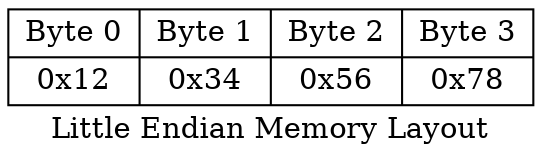
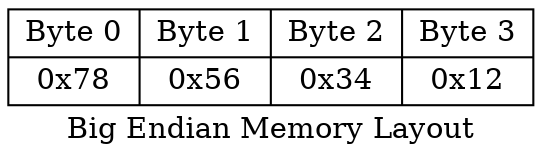

# CS:APP 第二章習題講解

contributed by <`SamKao-writer`>

## 內容概述
1. [Computer Systems:A Programmer's Perspective](https://csapp.cs.cmu.edu/3e/labs.html) 第二章的習題講解。
2. 搭配 [ISO/IEC 9899:1999](https://www.open-std.org/jtc1/sc22/wg14/www/docs/n1256.pdf) 作為講解習題時參考的第一手資料。
3. 部份內容涉及書中的 Equation 或程式碼，可搭配 [CS:APP 第二章重點解析](https://hackmd.io/1o8rVMTpRuaoJYCD6-UHDg) 內容。
4. 參考 [你所不知道的 C 語言：前置處理器應用篇](/J1Y5L55KS_OVEOQciiu_eg) ，以及使用 [X macro](https://en.wikipedia.org/wiki/X_macro) 寫出更為簡潔的程式碼。

## Prerequisite

部份習題需要採用 bitwise operation 完成，參考 [你所不知道的 C 語言：bitwise 操作](/WxAJUeZKQMuKk5IV9yBlqg) 整理其中的基本概念及對應操作，並且使用 [ISO/IEC 9899:1999](https://www.open-std.org/jtc1/sc22/wg14/www/docs/n1256.pdf) 進行 C 語言對應操作的說明。

### 基本觀念
1. 任何一個 bit 與 0 作 `&` 運算，該 bit 結果為 0。
2. 任何一個 bit 與 1 作 `&` 運算，該 bit 結果不變。
3. 任何一個 bit 與 0 作 `|` 運算，該 bit 結果不變。
4. 任何一個 bit 與 1 作 `|` 運算，該 bit 結果為 1。
5. 任何一個 bit 與 0 作 `^` 運算，該 bit 結果不變。
6. 任何一個 bit 與 1 作 `^` 運算，其 bit 結果為 ~ 的結果。

### Set a bit
:::info
假設 n 代表 bit index，用來表示要修改哪個位置的 bit。
假設 w 代表 data type width，表示某個資料型別使用的 bit 數目。
假設 least significant bit 的 index 為 0。
:::

```c
unsigned a |= (1 << n);
```

- C99 [6.5.7] **Bitwise shift operators**  第 3 點
  > The integer promotions are performed on each of the operands. The type of the result is that of the promoted left operand.

假設 $1$ 為 int 型態， $n$ 為 unsigned int 型態。

此處 `1 << n` 的運算元會進行 integer promotion，而 integer promotion 會將此處的 $1$ 轉型為 int 型態，並且 `bitwise inclusive OR |` 會進行 usual arithmetic conversion，根據 promoted 後的運算元的 integer conversion rank，將 $1$ 從 int 型態轉換成 unsigned int 型態。

關於 integer promotion 和 ususal arithmetic conversions 的介紹，可觀看 [CS:APP 第二章重點解析-2.2.5](https://hackmd.io/1o8rVMTpRuaoJYCD6-UHDg?view#225-Signed-versus-Unsigned-in-C) 內有詳細說明。

參考 [你所不知道的 C 語言：bitwise 操作- Set a bit](https://hackmd.io/@sysprog/c-bitwise#Set-a-bit)，推測為了視覺化方便，而使用 unsigned char 型態，但實際行為即使 $a$ 是 unsigned char 型態，尚未進行 assignment 的表達式 evaluation 的結果為 unsigned int 型態。

此處為求方便，雖然 $a$ 為 unsigned (int) 型態，但仍然只以 LSB 對應的 8 個位元來呈現 set a bit 的結果。

```
a              0 0 0 0 0 0 0 1
a |= (1 << 1)  0 0 0 0 0 0 1 1
a |= (1 << 3)  0 0 0 0 1 0 0 1
a |= (1 << 5)  0 0 1 0 0 0 0 1
```

### Clear a bit

```c
unsigned b &= ~(1 << n);
```

此處的 mask 的想法，先讓想要清除的 bit 設為 1，其餘為 0。透過 `~` 可以更改為想要清除的 bit 為 0，其餘為 1。之後與 mask 作 `&` 即可清除第 n 個 bit，並且保持其他 bit 不變。

- 若想了解更多關於 `~` 的規範，可參考 C99 [6.5.3.3] **Unary arithmetic operators**  第 4 點。

```
b               1 1 1 1 1 1 1 1
b &= ~(1 << 1)  1 1 1 1 1 1 0 1
b &= ~(1 << 3)  1 1 1 1 0 1 1 1
b &= ~(1 << 5)  1 1 0 1 1 1 1 1
```

### Toggle a bit

```c
unsigned c ^= (1 << n)
```

根據 `基本觀念` 第 5、6 點所述，針對想要反轉的 bit，將其與 $1$ 作 `^` 運算，而其餘 bit 則與 $0$ 作 `^` 運算，讓其值保持不變。根據此想法，運用 `1 << n` 做出對應的 mask。

```
c              1 0 1 0 1 0 1 0
c ^= (1 << 1)  1 0 1 0 1 0 0 0
c ^= (1 << 2)  1 0 1 0 1 1 1 0
c ^= (1 << 5)  1 0 0 0 1 0 1 0
```
### Show the result
根據上述的操作，撰寫程式觀察對應結果。
參見 [commit a27c188](https://reurl.cc/E6NZ50)，觀察其中的程式碼，透過撰寫 macro 定義 `SET_BIT` 和 `CLE_BIT`，並額外撰寫 `GET_BIT` 協助印出結果的 bit-level representation。

```c
#define SET_BIT(x, pos) (x |= (1 << pos))
#define CLR_BIT(x, pos) (x &= ~(1 << pos))
#define GET_BIT(x, pos) (!!(x & (1 << pos)))

int main()
{
    unsigned char a = 0xF0;
    unsigned char pos = 3;
    
    // Try to print out the current bit-level representation
    for (int i = (int)(sizeof(unsigned char) << 3) - 1; i >= 0; i--)
        printf("%2d", GET_BIT(a, i));
    printf("\n");
    
    return 0;
}
```

參見 [commit 8868e26](https://reurl.cc/Llx7kL)，由於 `main` 撰寫過多相同的函式，因此同樣以 macro 定義相似操作。

```diff
+#define PRINT(type, a)                                       \
+    for (int i = (int) (sizeof(type) << 3) - 1; i >= 0; i--) \
+        printf("%2d", GET_BIT(a, i));                        \
+    printf("\n")

-    for (int i = (int)(sizeof(unsigned char) << 3) - 1; i >= 0; i--)
-        printf("%2d", GET_BIT(a, i));
-    printf("\n");
+    PRINT(unsigned char, a);
```

## 2.55
- 編譯並執行含有 `show_bytes` 函式的程式碼，了解使用機器為 big-endian 或 little-endian。

```c=
void show_bytes(unsigned char *start, size_t len)
{
    int i;
    for (i = 0; i < len; i++)
        printf(" %.2x", *(start + i));
    printf("\n");
}

int main(int argc, char *argv[])
{
    int a = 0xFF;
    show_bytes((unsigned char *)&a, sizeof(int));
    return 0;
}
```

```bash
 ff 00 00 00
```
執行環境為 little-endian。

## 2.56
- 嘗試以 `show_bytes` 執行不同資料型態的數值。

第一種寫法：
參見 [commit b5f7586](https://reurl.cc/7dq70N) 的 `show_bytes0.c`

```c=
void show_int(int i)
{
    show_bytes((unsigned char *)&i, sizeof(int));
}

void show_double(double d)
{
    show_bytes((unsigned char *)&d, sizeof(double));
}

void show_pointer(void *p)
{
    show_bytes((unsigned char *)&p, sizeof(void*));
}

void test_show(int val)
{
    int ival = val;
    double dval = (double) val;
    void *p = (void *)&val;
    
    show_int(ival);
    show_double(dval);
    show_pointer(p);
}

int main(int argc, char *argv[])
{
    int test_num = 328;
    
    test_show(test_num);
    
    return 0;
}
```

```bash
 48 01 00 00
 00 00 00 00 00 80 74 40
 1c 1c 54 68 fd 7f 00 00
```

可以從中發現 `show_int` 和 `show_double` 除了型態不同外，並無任何差異。因此可以定義 macro 並使用 concatenation 技巧避免宣告重複性過高的函式。

第二種寫法：
參見 [commit b5f7586](https://reurl.cc/E6v4gm) 中的 `show_bytes1.c`

```c
#define DECLARE_SHOW_BYTES(type)                        \
    static inline void show_##type(type x)              \
    {                                                   \
        show_bytes((unsigned char *) &x, sizeof(type)); \
    }
```
接著透過 macro 來宣告想要的函式：

```c
DECLARE_SHOW_BYTES(int);
DECLARE_SHOW_BYTES(double);
```

透過 `gcc -E` 觀察對應的輸出：
```bash
static inline void show_int(int x) { show_bytes((unsigned char *) &x, sizeof(int)); };
static inline void show_double(double x) { show_bytes((unsigned char *) &x, sizeof(double)); };
```

與原始的寫法產生相同的函式，但可以讓程式碼更加簡潔。
類似的技巧可以參見 [你所不知道的 C 語言：前置處理器應用篇](/J1Y5L55KS_OVEOQciiu_eg) 和 [你所不知道的 C 語言：物件導向程式設計篇](/0FiEdsGERFKD-fPTrUK0HA)。

第三種寫法: [X macro](https://en.wikipedia.org/wiki/X_macro)
參見 [commit 60741e9](https://reurl.cc/lyj9qv)

先定義會使用到的 data type:
```c
#define DATATYPE_LIST \
    X(int)            \
    X(double)
```

使用 X macro 宣告 function:
```c
#define X(type) static inline void show_##type(type x);
    DATATYPE_LIST
#undef X
```

使用 X macro 定義 function:
```c
#define X(type)                                         \
    static inline void show_##type(type x)              \
    {                                                   \
        show_bytes((unsigned char *) &x, sizeof(type)); \
    }
    DATATYPE_LIST
#undef X
```

使用 `gcc -E` 觀察對應結果：
```
static inline void show_int(int x); static inline void show_double(double x);
```
```
static inline void show_int(int x) { show_bytes((unsigned char *) &x, sizeof(int)); }
static inline void show_double(double x) { show_bytes((unsigned char *) &x, sizeof(double)); }
```

後續題目針對不同長度的資料型別，也會使用相同技巧去定義類似的 function，藉此減少過多冗餘的程式碼。

## 2.58
- 撰寫函式 `is_little_endian` ，若執行環境為 little endian，函式 return 1，否則 return 0。

```c=
int is_little_endian(void)
{
    int mask = 0xFF;
    int *p = &mask;
    return (*(unsigned char *)p == 0xFF);
}
```

下方兩圖分別代表 `little endian` 及 `big endian` 在記憶體中的狀況。上述程式碼的 mask 只要 LSB 與 MSB 內容相異，就可以透過指向 mask 的指標進行 type casting，讓其指向 Byte address 最小的位置，並進行比較即可得知是否為 little endian。





## 2.59
- 撰寫 C 的表達式，取得運算元 $x$ 的 LSB 以及運算元 $y$ 剩餘的 bytes。例如： $x =$ 0x89ABCDEF， $y =$ 0x76543210，則該表達式應該在 evaluation 後應為 0x765432EF。

```c
(x & 0xFF) | (y & ~0xFF);
```

```c=
#include <assert.h>

int main(int argc, char *argv[])
{
    int mask = 0xFF;
    int x = 0x89ABCDEF;
    int y = 0x76543210;

    int res = (x & mask) | (y & ~mask);
    assert(res == 0x765432EF);
    return 0;
}
```

此題測驗如何透過製作特定的 mask 取出特定的 byte(s)。

## 2.60
- 假設一個 word 有 $w$ 個 bit 長，將其位元組進行編號，從 $0$ 開始至 $w/8-1$。例如 32 bit 長的型態，其位元組編號為 0，1，2，3。以此定義為基準，撰寫一個函式 `replace_byte`，將 argument $x$ 的第 $i$ 個 byte 以另外一個 byte $b$ 進行替換。

函式原型:
```c
unsigned replace_byte(unsigned x, int i, unsigned char b);
```
以下為該函式執行後預期的結果：
```bash
replace_byte(0x12345678, 2, 0xAB) --> 0x12AB5678
replace_byte(0x12345678, 0, 0xAB) --> 0x123456AB
```

對應寫法：
```c=
unsigned replace_byte(unsigned x, int i, unsigned char b)
{
    unsigned offset = (sizeof(unsigned char) << 3) * i;
    unsigned mask = (unsigned)0xFF << offset;
    unsigned replace_mask = (unsigned)b << offset;
    
    return (x & ~mask) | (replace_mask & mask);
}
```

想法：
1. 將 argument $x$ 對應編號的 byte 清成 $0$，其餘 bytes 不變。
2. 要替換的 byte 也必須 shift 到對應編號的位置。

上述兩件事情都可以透過同一個 mask 完成 (類似 [2.59](https://hackmd.io/wRDAp3HYSo6lmMUGPNIxLg?view#259))。mask 的位移量使用 `sizeof` 配合 shift operation 完成，readability 和 portability 較高。此外 `line 6` 的 `b << offset`，雖然 $b$ 本身是 unsigned char 型態，但因為 shift operator 會將左運算元進行 integer promotion，因此結果為 int 型態。為了將 mask 與 $x$ 的型態保持一致，此處避免 implicit conversion 影響結果，因此先用 type casting，避免程式出現 bug。(以此題為例，不論是 mask 或 replace_mask 都可以使用 int 型態，其結果仍為正確，因為 bitwise inclusive OR `|` 和 bitwise AND `&` 都會進行 usual arithmetic conversion。但養成好習慣，避免未來忽略 implicit conversion 造成程式錯誤。)

此處與 C99 規格書相關的內容:
- C99 [6.5.7] **Bitwise shift operators** 
 可參考 [CS:APP 第二章重點解析--2.19](https://hackmd.io/1o8rVMTpRuaoJYCD6-UHDg?view#219-Shift-Operations-in-C) 內有提及。
- C99 [6.3.1.1] **Boolean, characters, and integers** 第 2 點 （integer promotion）
 可參考 [CS:APP 第二章重點解析--2.2.5](https://hackmd.io/1o8rVMTpRuaoJYCD6-UHDg?view#225-Signed-versus-Unsigned-in-C) 內有提及。
- C99 [6.5.10] **Bitwise AND operator** 第 3 點
  > The usual arithmetic conversions are performed on the operands.
- C99 [6.5.12] **Bitwise inclusive OR operator** 第 3 點
  > The usual arithmetic conversions are performed on the operands.

## Bit-Level Integer Coding Rules
接下來的幾個問題，書中提到為了讓讀者更加熟練 C 的 bitwise, logic, arithmetic operations，因此加上一些限制。
- 假設：
    1. 整數以二補數進行編碼
    2. 有號數的右移為算術右移
    3. 資料型態 int 為 $w$ 個 bit。部份問題會表明 $w$ 的值，其餘問題只須假設 $w$ 為 $8$ 的倍數。可以使用 `sizeof(int) << 3` 來計算 $w$。
- 禁止：
    1. conditionals, loops, switch statements, function calls, and macro invocations.
    2. 除法運算，餘數運算，乘法運算
    3. Relative operators (<,>,<=,>=)
- 允許的運算:
    1. 所有 bitwise operation 及 邏輯運算
    2. 左移和右移，但位移量必須介於 $0$ 和 $w-1$
    3. 加法和減法
    4. Equality(==) 和 inequality(!=)。（有些問題會被禁止）
    5. 常數： INT_MIN 和 INT_MAX
    6. int 和 unsigned 之間的轉型，不論是顯性轉型或隱式轉型皆可。

舉例來說，以下程式碼符合上述規則，功能為取出 $x$ 的 MSB。

```c=
int get_msb(int x)
{
    /* Shift by w-8 */
    int shift_val = (sizeof(int) - 1) << 3;
    /* Arithmetic shift */
    int xright = x >> shift_val;
    /* Zero all but LSB */
    return xright & 0xFF;
}
```

## 2.61
- 撰寫 C 表達式，當下列條件符合時 return 1，否則 return 0。假設 $x$ 為 int 型態。
A. Any bit of x equals 1.
B. Any bit of x equals 0.
C. Any bit in the least significant byte of x equals to 1.
D. Any bit in the most significant byte of x equals to 0.
此處不能使用 == 和 != 運算符。

參見 [commit fb2e5aa](https://reurl.cc/DlMdNR)，先使用函式完成實作。

答：
A.
```c
!!x;
```
由於 `!` 運算符將非零運算元轉換成 $0$，而零運算元轉換成 $1$。再使用一次 `!` 的效果可讓非零運算元轉換成 $1$，而零運算元轉換成 $0$。

B.
```c
!!~x;
```
本題要偵測 $x$ 是否有任何 bit 為 $0$，對 $x$ 作 bitwise complement ，則此問題等價於「偵測 $\text{~}x$ 是否有任何 bit 為 $1$」，此時可以透過 `A` 小題的解法，用 `!!` 進行運算。 

C.
```c
!!(x & 0xFF);
```
首先要取得 $x$ 的 LSB，直接與 mask 0xFF 進行 bitwise AND 即可取得。`&` 會對運算元進行 integer promotion，實際上 `x & 0xFF` 的結果為 int 的 width，並非只有 8 個 bit。(只是前面的 bit 皆為 $0$。)之後使用 `A` 小題的 `!!` 即可偵測該 byte 是否有任何 bit 為 $1$。因此答案也等價於：
```c
A(x & 0xFF); 
```

D.
```c
x = (x >> ((sizeof(int) - sizeof(char)) << 3)) | ~0xFF;
return  B(x); 
  
```
本題禁止 function call，為求方便講解，因此使用該形式描述。首先思考上述程式碼想法，再改成表達式版本。

1. `x >> ((sizeof(int) - sizeof(char)) << 3)` 為了取出 $x$ 的 MSB，因此將 $x$ 右移至 LSB，然而右移完的結果為當前的 LSB 為原先的 MSB，但剩餘的 bytes 為 sign extension 的結果，未必保證全 $0$ 或 全 $1$。 為了讓前 24 個 bit 保持固定，應該考慮與某個 mask 進行 bitwise operation。
2. 因為要將目前的表達式作為 `B` 小題解法的 argument，因此需要回顧 `B` 小題的作法。`B` 小題的精髓在於把問題從 「$x$ 是否含有任何 bit $0$」變成 「$\text{~}x$ 是否含有任何 bit $1$」，也就是說本質上還是透過檢查是否含有 bit $1$ 來達成。因此若現在將 LSB 以外的所有 bit 變成全 $1$，才能當作 `B` 的 argument 時，透過 `~` 變成全 $0$，之後 `!!` 才能只針對 LSB 偵測是否有 $1$。（因為 LSB 也受到 `~` 影響，偵測是否含 bit $0$，變成偵測是否含 bit $1$。）

總結上述程式碼及講解，不使用 function call 的作法為：
```c
!!~((x >> ((sizeof(int) - sizeof(char)) << 3)) | ~0xFF);
```

## 2.62
- 撰寫一個函式 `int_shifts_are_arithmetic` 來判斷該機器的有號數右移是否為算術右移，是則回傳 $1$，否則回傳 $0$。

第一種寫法：
參見 [commit 120843c](https://reurl.cc/MjxE6v)。
```c=
int int_shifts_are_arithmetic(void)
{
    int mask = ~0; /* -1 */
    return mask == (mask >> 1);
}
```

此寫法透過將 $-1$ 進行右移，若為算術右移，則其值不變。

第二種寫法：
參見 [commit 120843c](https://reurl.cc/ZV5xZl) 後段。
```c=
int int_shifts_are_arithmetic(void)
{
    int num = ~0;   /* -1 */
    return !(num ^ (num >> 1));
}
```

此寫法不依賴 Equality operator (==)，但原理大同小異，因為 bitwise exclusive OR `^` 在兩個運算元相等時，可得結果 $0$，可視為一種替代 equality operator 的方式。因此若將 $-1$ 右移一個 bit，則只有 most significant bit 有可能與原先不同，因此使用 `^` 後只有第一個 bit 有機會是 $1$，其餘為 $0$，此時參考 [2.61 A 小題](https://hackmd.io/wRDAp3HYSo6lmMUGPNIxLg?view#261) 概念，使用 `!` 運算符即可得到答案。

## 2.63
- 請用算術右移實作邏輯右移，以及利用邏輯右移實作算術右移，下方兩個函式 `srl` 和 `sra` 分別為對應的函式。對於函式 `srl`，會先獲得一個數值 `xsra`，試著不使用右移以及除法運算完成邏輯右移。對於函式 `sra`，會先獲得一個數值 `xsrl`，試著不使用右移以及除法運算完成算術右移。可以使用 `sizeof(int) << 3` 計算 unsigned 和 int 的寬度 $w$。並且位移量 $k$ 的範圍可從 $0$ 至 $w-1$。

第一種作法：
參見 [commit ca641c6](https://reurl.cc/0d8rKo)。

```c=
unsigned srl(unsigned x, int k)
{
    /* Perform shift arithmetically */
    unsigned xsra = (int)x >> k;
    /* Determine the width of the mask */
    int offset = (sizeof(int) << 3) - k;
    /* Using ~0 and left shift to become a mask */
    unsigned mask = ~0 << offset;
    /* Using bitwise AND to finish */
    return xsra & ~mask;
}
```

使用算術右移實作邏輯右移：由於 unsigned $x$ 已經右移 $k$ 個 bit，因此高位的 $w-k$ 個 bit 需要被改為全 $0$。因此利用 $\text{~}0$ 製作一個全 $1$ 的 mask，並將其左移 $w-k$ 個 bit，使高位的 $k$ 個 bit 為全 $1$。之後讓被算術右移的數值與取 complement 的 mask 進行 bitwise AND 即可得到答案。
  
```c=
int sra(int x, int k)
{
    /* Perfrom shift logically */
    int xsrl = (unsigned)x >> ｋ;
    /* Determine the width of the mask */
    int offset = (sizeof(int) << 3) - k;
    /* Using ~0 and left shift to become a mask */
    int mask = ~0 << offset;
    /* To determine the higher (w-k) should be 1 or 0*/
    int m = 1 << ((sizeof(int) << 3) - 1);
    mask &= !(x & m) - 1;
    /* Using bitwise inclusive OR to finish */
    return xsrl | mask;
}
```

使用邏輯右移實作算術右移：由於 int $x$ 已經透過邏輯右移 $k$ 個 bit，因此類似上一個小題利用一個 mask 更動高位的 $k$ 個 bit 即可。然而與前一題不同的是，邏輯右移的高位必然為 $0$，而算術右移則根據 sign bit 的不同，可能是 $0$ 或 $1$，因此需要對 mask 也進行調整。考量題目敘述不能再使用任何右移運算，因此透過將 $1$ 左移 $w-1$ 個 bit，並與原先 $x$ 進行 bitwise AND 運算，此時結果只能是 $0$ 或 INT_MIN。之後對該結果取 logical NOT，則結果為 $1$ 或 $0$，與 $1$ 相減後，結果為 $0$ 或 $-1$。此時，mask 與該結果進行 bitwise AND，可讓 mask 的前 $k$ 個 bit 根據 $x$ 的 sign bit 設為全 $1$ 或全 $0$，並且低位的 $w-k$ 個 bit 仍為全 $0$。再將原先邏輯右移後的結果與 mask 作 bitwise inclusive OR 即可得到答案。 

由於該題較為繁瑣，此處運用範例搭配圖解，以了解運算過程。
為了理解方便，此處假設 int 僅 16 個 bit。
假設 int $x$ 為 `0xAB`，而 $k$ 為 $8$。

1. 根據 `line 6`，計算出 offset 為 $8$。
2. 根據 `line 8`，將 `-1` 左移 $8$ 個 bit，使低位的 $8$ 個 bit 為 $1$，而高位的 $8$ 個 bit 為 $0$。
    ```bash
    mask: 1111 1111 0000 0000
    ```
3. 算術右移會根據 sign bit 而使高位的 bit 填 $0$ 或 $1$，因此 mask 高位的 $1$，需要根據 $x$ 的 sign bit 而有所調整。
4. 由於不能再使用右移操作，要判斷 $x$ 的 sign bit，改為將 $1$ 左移 $15$ 個 bit，並與 mask 作 bitwise AND。
    ```bash
    m:    1000 0000 0000 0000
    mask: 1111 1111 0000 0000
    ```
5. 經過 `(x & m)` 後，該表達式結果為 $0$ 或 INT_MIN。此時先行思考想要的 mask 形式，若 sign bit 為 $0$，mask 應該讓高位的 $1$ 改成 $0$ ;若 sign bit 為 $1$，則 mask 應保持不變。
6. 因此透過將 `(x & m)` 的結果取 logical NOT，使表達式結果為 $1$ 或 $0$，此時再將該結果減 $1$，讓結果為 $0$ 或 $-1$。此時讓 mask 跟該表達式進行 logical AND，與 $0$ 作 `&` 則 mask 變為全 $0$，與 $-1$ 作 `&` 則 mask 不變。再將該結果與右移後的 $x$ 與 mask 進行 bitwise inclusive OR，可完成算術右移的效果。

然而上述作法存在缺陷，因為 $k$ 的範圍為 $0$ 到 $w-1$，因此上述 `offset` 對應的 `w-k` 範圍為 $1$ 到 $32$，其中當 $w-k$ 為 $32$，則對應的 shift shift operation 為未定義行為：
- C99 [6.5.7] **Bitwise shift operators** 第 3 點
  > If the value of the right operand is negative or is greater than or equal to the width of the promoted left operand, the behavior is undefined.
  
第二種作法：


## 2.64
- 撰寫函式 `any_odd_one` 檢查奇數位的 bit 是否含有任何 $1$。假設 int 有 32 個 bit。且至多總共只能用 12 個 bitwise, arithmetic, logical operations。

```c=
int any_odd_bit(unsigned x)
{
    return !!(x & 0xAAAAAAAA);
}
```

根據題目假設，int 型態共有 32 個 bit，若 least significant bit 當作第 0 個 bit，則此處 mask 為 `0xAAAAAAAA`。若 least significant bit 當作第 1 個 bit，則 mask 應為 `0x55555555`。

## 2.65
- 以下列註解完成對應程式碼。
```c=
/* Return 1 when x contains an odd number of 1s; 0 otherwise. 
 * Assume w = 32 
 */
int odd_ones(unsigned x);
```

先假設 $w = 8$，並逐步講解想法。
假設 
```bash
x = 1101 0111
```
1. 首先，要能讓所有 bit 都被計算到。以此想法為基礎，若有奇數個 $1$ 進行 bitwise exclusive OR `^`，則結果為 $1$ ;若為偶數個 $1$，則結果為 $0$。
2. 接下來思考如何在不使用 loop 的情形讓各個 bit 都被剛好計算一次。思考移位運算 `x >> 1`，此時若讓原先的 $x$ 與 `x >> 1` 進行 `^` 運算，則除了最高位的 bit 外，每個 bit 的結果都代表與前 $1$ 個 bit 有奇數或偶數的 $1$。
    ```bash
    x:              1101 0111
    x >> 1:         0110 1011
    x ^= x >> 1:    1011 1100
    ```
3. 觀察上方區塊，有另外一種解釋方式。假設最低位為第 $0$ 個 bit，經過移位運算和 `^` 運算，觀察第 $2k$ 個 bit（$k$ 為非負整數），其結果為第 $2k$ 和 $2k+1$ 個 bit 含有奇數或偶數個 $1$ 的結果。
4. 接著，將當前的 $x$ 與 `x >> 2`　進行 `^` 運算。
    ```bash
    x:              1011 1100
    x >> 2:         0010 1111
    x ^= x >> 2:    1001 0011
    ```
5. 觀察原先的 $x$，此時 $x$ 的第 $4k$ 個 bit，為原先 $x$ 的第 $4k$, $4k+1$, $4k+2$, $4k+3$ 個 bit 計算有奇數或偶數個 $1$ 的結果。
6. 依此類推，將當前的 $x$ 與 `x >> 4` 進行 `^` 運算。
```bash
x:            1001 0011
x >> 4:       0000 1001
x ^= x >> 4:  1001 1010
```
7. 觀察當前 $x$ 的第 $8k$ 個 bit，為原先 $x$ 的第 $8k$ ~ 第 $8k+7$ 個 bit 計算有奇數或偶數個 $1$ 的結果。

依照上方想法，最終只要看第 $0$ 個 bit 結果即可得知原先 argument 在bit-level representation 情形下是否具有奇數的 $1$。

```c=
int odd_ones(unsigned x)
{
    x ^= x >> 1;
    x ^= x >> 2;
    x ^= x >> 4;
    x ^= x >> 8;
    x ^= x >> 16;
    
    return x & 0x1;
}
```

觀看網路上的寫法：
[Stack Overflow](https://stackoverflow.com/questions/9133279/bitparity-finding-odd-number-of-bits-in-an-integer/9133406#9133406)
```c=
int odd_ones_r(unsigned x)
{
    x ^= x >> 16;
    x ^= x >> 8;
    x ^= x >> 4;
    x ^= x >> 2;
    x ^= x >> 1;
    
    return x & 0x1;
}
```

並撰寫以下程式碼判斷是否在 32 bit 的 unsigned integer 下，兩個含是在某些 argument 會有不同結果。

```c=
int main(int argc, char *argv[])
{
    for (unsigned i = 0; i != UINT_MAX; i++) {
        if (odd_ones(i) != odd_ones_r(i)) {
            printf("Difference in %d\n", i);
            break;
        }
    }
    return 0;
}
```

然而執行後的結果並未印出任何訊息，代表兩函式在所有 32 bit 可表示的 unsigned integer 下，並未有任何不同的結果。

同樣將範圍縮小，假設 $w = 8$，來繪製計算過程及結果。前面已描述過此題的解法為將所有 bit 透過 `^` 運算，算出有奇數或偶數的 $1$。因此接下來將繪製不同過程下，每個 bit 所代表的是哪些 bit 經過 `^` 運算的結果。

方法一:
```bash 
x:              7 6 5 4 3 2 1 0
-------------------------------
x ^= x >> 1     7 6 5 4 3 2 1 0
                  7 6 5 4 3 2 1
-------------------------------
x ^= x >> 2     7 6 5 4 3 2 1 0
                  7 6 5 4 3 2 1
                    7 6 5 4 3 2
                      7 6 5 4 3
-------------------------------
x ^= x >> 4     7 6 5 4 3 2 1 0
                  7 6 5 4 3 2 1
                    7 6 5 4 3 2
                      7 6 5 4 3
                        7 6 5 4
                          7 6 5
                            7 6
                              7
-------------------------------                           
```

方法二：
```bash
x:              7 6 5 4 3 2 1 0
-------------------------------
x ^= x >> 4     7 6 5 4 3 2 1 0
                        7 6 5 4
-------------------------------
x ^= x >> 2     7 6 5 4 3 2 1 0
                    7 6 7 6 5 4
                        5 4 3 2
                            7 6
-------------------------------
x ^= x >> 1     7 6 5 4 3 2 1 0
                  7 7 6 7 6 5 4
                    6 5 5 4 3 2
                      7 4 3 7 6
                        6 7 2 1
                          5 6 5
                            4 3
                              7
-------------------------------                           
```
將最後結果每個 bit 經過運算的 bit sequence 進行排序：
```bash
                7 6 5 4 3 2 1 0
                  7 6 5 4 3 2 1
                    7 6 5 4 3 2
                      7 6 5 4 3
                        7 6 5 4
                          7 6 5
                            7 6
                              7
```
發現方法一和方法二不只在第 $0$ 個 bit 計算過的 bit 編號相同，其餘 bit 的結果也相同。因此兩者方法的輸出結果相同，過程的中間產物不同。

## 2.66
- 以下列註解完成程式碼：
```c=
/*
 * Generate mask indicating leftmost 1 in x. Assume w = 32.
 * For example, 0xFF00 -> 0x8000, and 0x6600 -> 0x4000. 
 * If x = 0, then return 0.
 */ 
int leftmost_one(unsigned x);
```

給予一個 unsigned integer $x$，將 most significant one 保留，其餘的 bit 全設為 $0$，至多只能使用 15 個 bitwise, arithmetic, logical operations。[Hint:將 $x$ 對應的 bit vector 改為 [0...01...1] 的形式。]

```c=
int leftmost_one(unsigned x)
{
    /* Make bit vector to be format [0...01...1] */
    x |= x >> 1;
    x |= x >> 2;
    x |= x >> 4;
    x |= x >> 8;
    x |= x >> 16;
    
    return x ^ (x >> 1);
}
```

此段程式碼的前半段都是為了將 most significant one 後面的 bit 改為全 $1$，解釋其過程。（後續簡稱 most significant one 為 MSO。）
1. `x |= x >> 1`。此段表達式使得 MSO 及下一個 bit 為 $1$，保證從 MSO 開始往後算，至少有兩個連續的 $1$。
2. `x |= x >> 2`。因為前面保證有兩個連續的 $1$，此段表達式使得現在 MSO 開始計算，至少有連續四個 $1$。
3. 後續依此類推。

測試程式如下：
```c=
int main(int argc, char *argv[])
{
    assert(leftmost_one(0XFF00) == 0x8000);
    assert(leftmost_one(0X6600) == 0x4000);
    assert(leftmost_one(0xFF000000) == 0x80000000);
    assert(leftmost_one(0) == 0);
    return 0;
}
```

觀看 [CS:APP 第 2 章重點提示和練習-2.66解答](https://hackmd.io/@sysprog/ryrcmhjOM?type=view#266)
其返回該行的寫法為：
```c
return x & (~x >> 1);
```


